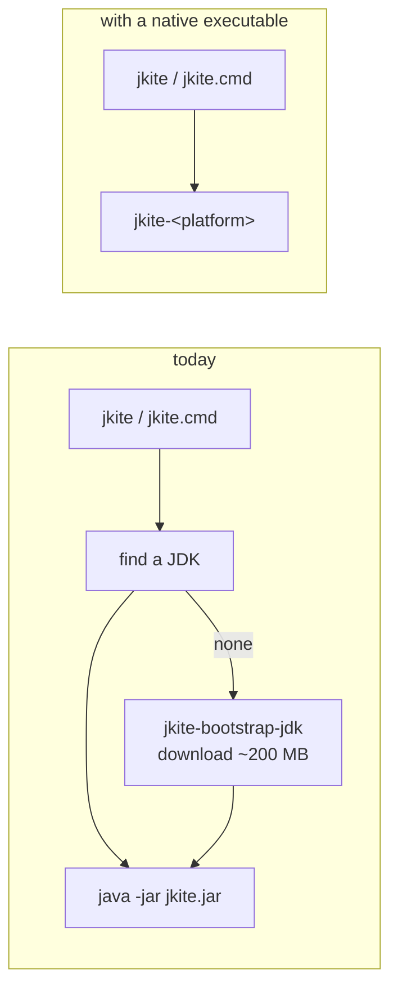

# Building a native executable

> **This was not adopted. The branch it lives on is an archive.**
>
> Everything below works and was measured on a real build. It is kept because
> the measurements are expensive to redo and the dead ends are worth knowing,
> not because it is the direction jkite is going. See
> [Why this was dropped](#why-this-was-dropped) before building on it.

jkite is a jar, and a jar needs a JVM. That single fact is why the launchers
are as large as they are: before they can run jkite they have to find a Java,
and when the machine has none they install one. `jkite-bootstrap-jdk` and its
cmd twin exist for nothing else, and `jkite.properties` carries a JDK URL and
digest for each of six platforms to feed them.

A native executable removes the premise. GraalVM's `native-image` compiles the
jar ahead of time into a program the operating system runs directly, so there
is no JVM to find and nothing to install before jkite starts.

## What changes



The JDK does not disappear from jkite's life: a script still declares `//JAVA`
and still needs a compiler. But that JDK is installed by jkite itself, in Java,
where the logic already lives (`jdk/JdkManager`). What goes away is the second,
earlier JDK whose only job was to start jkite.

## What native-image needs to know

`native-image` decides at build time which code can ever run, and leaves out
the rest. That is where the size and the startup time come from, and also the
one way it can go wrong: code reached by name at run time - reflection, a
resource read off the class path, a service looked up by interface - is
invisible to that analysis unless it is declared.

Those declarations live in `src/native-image/config/reachability-metadata.json`.
jkite's is small, and it is small for reasons worth keeping:

| Library | Why it is cheap |
| --- | --- |
| gson | Used through the tree API (`JsonParser`, `JsonObject`), never bound to classes. Nothing to register. |
| commons-compress | Streams are constructed directly (`new TarArchiveInputStream`), not looked up through `ArchiveStreamFactory`. No service lookup. |
| MIMA / Maven Resolver | Runs on `standalone-static`, the runtime that wires itself without dynamic injection. Needs a handful of `.properties` resources, nothing more. |
| slf4j-nop, jspecify | No run-time lookup at all. |

What the metadata does contain is mostly not jkite's: the JDK's own cipher and
key classes, which TLS reaches by name, and the resources Maven Resolver reads
to learn its own version.

The file is regenerated by running the jar under the tracing agent, which
records what the code actually reaches:

```sh
"$GRAALVM_HOME/bin/java" \
  -agentlib:native-image-agent=config-output-dir=src/native-image/config \
  -jar build/libs/jkite.jar some-script-with-deps.java
```

Exercise the network path when doing this. A run that resolves everything from
the local repository never opens a TLS connection, and the cipher classes will
be missing from the result.

## Building

```sh
export GRAALVM_HOME=/path/to/graalvm-community-25   # or put native-image on PATH
./gradlew nativeImageArchive        # or nativeImage, for the executable alone
```

The output is `build/native-image/jkite-<platform>` - `linux-amd64`,
`darwin-arm64`, and so on, named the way `jkite.properties` names platforms so
a built file drops straight into that table - and `jkite-<platform>.tgz`, which
is what a release publishes. Each gets a `.sha256` beside it, because that is
how a release pins anything here.

`--no-fallback` is passed on purpose. Without it, a build that cannot resolve
everything quietly emits a launcher that needs a JVM after all - an executable
that looks right and defeats the point. With it, that case is a failed build.

## One platform per machine

`native-image` does not cross-compile. An executable is built for the machine
building it, so shipping six platforms means building on six machines. That is
what `.github/workflows/native.yml` is: one runner per row of
`jkite.properties`, all of them GitHub-hosted.

arm64 Linux and Windows runners became generally available for public
repositories in August 2025, which is what makes four of the five rows possible
without self-hosted machines or QEMU.

The fifth platform, `darwin-amd64`, is not built. GraalVM removed macOS x64
after 25.0.1: releases from 25.0.2 on ship no `macos-x64` build, so there is no
compiler to run. Pinning an Intel Mac job to 25.0.1 would freeze it on a
release that no longer receives fixes, which is worse than shipping nothing, so
Intel Macs get the jar instead. GitHub is retiring `macos-15-intel` in August
2027 regardless.

This is the shape of the risk generally: a native target exists only while
someone builds a compiler for it. Losing one is not a build failure to debug,
it is a platform moving back to the jar.

## Which GraalVM

`native-image` comes from a GraalVM distribution, and there are several. They
are the same technology; what differs is who builds and supports it.

| | |
| --- | --- |
| **GraalVM Community Edition** | Open source, GPLv2+CE. What CI uses and what this was developed against. |
| Oracle GraalVM | Oracle's build, under the GraalVM Free Terms and Conditions. |
| Mandrel | Red Hat's rebuild of Community Edition, native-image only, maintained for Quarkus. |
| Liberica NIK | BellSoft's build. |

Worth knowing while choosing: in September 2025 Oracle detached GraalVM from
the Java SE release train. GraalVM for JDK 24 was the last release covered by
Oracle Java SE support, the Graal JIT left the Oracle JDK, and Oracle's team
moved its focus to the non-Java Graal languages, with Java startup and
footprint work continuing in OpenJDK's Project Leyden instead. OpenJDK's
Project Galahad, which was to bring this technology into the JDK, was dissolved
in March 2026.

Native Image itself was not deprecated: Community Edition releases monthly, and
Red Hat continues Mandrel for Quarkus. But the technology is now carried by the
community rather than by Oracle's Java strategy, which is a reason to keep the
jar working rather than to treat the executable as the only way jkite runs.

## Measured

On one Linux x64 machine, GraalVM CE 25.0.1:

| | jar on a JVM | native |
| --- | --- | --- |
| startup (`--version`, median of 9) | 49 ms | 5 ms |
| size | 6.3 MB jar + a JDK | 33 MB, nothing else |
| build | seconds | 1 m 21 s |

Verified end to end: `--version`, `--help`, running a plain script, resolving a
dependency from the local repository, and downloading one from Maven Central
over HTTPS.

## Size

The executable carries the parts of the JDK it uses, so it is larger than the
jar and smaller than the jar plus a JDK. `-Os` is passed because it is free
here: it takes about a fifth off and measured start did not change, since a
process that starts, builds one program and exits never reaches the throughput
`-O2` is buying.

Measured on the same machine:

| | file | start |
| --- | --- | --- |
| default (`-O2`) | 41.5 MB | 4.9 ms |
| **`-Os`** | **33.7 MB** | **4.8 ms** |
| `-Os`, then `strip` | 33.7 MB - no change | - |
| `-Os`, then UPX `--best` | 11.0 MB | 119.9 ms |

`strip` does nothing: native-image already emits a stripped binary. Charsets
and locales are likewise already minimal - `-H:AddAllCharsets` is off by
default and only the default locale is included.

UPX is the interesting one, and it is rejected. It is the largest reduction
available and it costs 115 ms per run, because the whole executable is
decompressed into memory on every start. That is slower than the jar on a JVM,
which makes it a trade of the one thing this was built for against a number
that only shows up in `ls`.

Compression belongs at the download instead, where it is paid once per machine
rather than once per run. That is what `nativeImageArchive` is for: 33.7 MB
becomes 12.1 MB, and starting is untouched because nothing is decompressed at
run time.

### Why .tgz

The format is not free choice - it has to be unpackable with what each machine
already has, since the bootstrap scripts install no tools. Measured, with
libarchive's bsdtar standing in for the tar Windows ships:

| | Windows `tar.exe` | Linux GNU `tar` | executable bit |
| --- | --- | --- | --- |
| bare `.gz` | `Unrecognized archive format` | exits 0, unpacks nothing | - |
| **`.tgz`** | **works** | **works** | **0755 kept** |
| `.zip` | works | `This does not look like a tar archive` | only if the writer set it |

A bare `.gz` is the one to rule out first: Windows ships no `gzip.exe`, its tar
refuses a file that is not an archive, and PowerShell is not available to these
scripts by design. Worse, GNU tar handed a bare `.gz` exits 0 having unpacked
nothing, so a launcher checking the exit status would report success.

A `.zip` fails from the other side - GNU tar cannot read one and `unzip` is not
something to assume, Git for Windows does not ship it either - and it carries
the executable bit only if whatever wrote it chose to, while nothing here
chmods after unpacking.

`.tgz` rather than `.tar.gz` only because Windows hides known extensions, which
displays `jkite-x.tar.gz` as `jkite-x.tar`. Both tars read the file by content,
and `Unpacker` already accepts either.

The JDK archives are a different case and stay as they are: `.zip` on Windows
and `.tar.gz` elsewhere is not a choice jkite made, it is how Adoptium
publishes them.

## How a machine gets one

`jkite-bootstrap-bin` and its cmd twin install the executable the way
`jkite-bootstrap-jar` installs the jar: the URL and SHA-256 come from
`jkite.properties`, the archive is verified before it is unpacked, and the
result lands in `~/.jkite/cache/native/<version>`. `misc/update-dist.sh` writes
those rows from the archives a Native CI run produced, so a release with no
archives is a jar-only release rather than a broken one.

The launcher prefers it. `jkite-bootstrap-bin --check` says which case a
machine is in without downloading anything - installed, would download, or no
executable for this platform - and the launcher asks about the download before
it happens, as it already did for the jar and the JDK. Where there is no
executable the jar runs, which works wherever a JVM does, and
`JKITE_USE_JAR=true` takes the jar either way, which is how that path stays
exercised on a platform that has both.

What this removes is the bootstrap JDK. It exists only to run `jkite.jar`, so a
machine running the executable never fetches it: one download of 12 MB instead
of two totalling over 200 MB. The JDK a script asks for with `//JAVA` is
unaffected - jkite installs that itself, in Java, as it always did.

The archive's hash is checked before unpacking, and not again afterwards. The
other option was to hash the installed executable on every run, the way the jar
is checked, and it is not worth it at this size: reading 33 MB costs more than
the executable's entire start.

## Things that behave differently

**`java.home` is not set.** There is no JVM under the executable, so
`System.getProperty("java.home")` returns null. `JdkManager.listInstalled`
treats that as "this process contributes no JDK" rather than dereferencing it;
the other origins - `JAVA_HOME`, `javac` on `PATH`, the cache - are unaffected.

**`JAVA_TOOL_OPTIONS` and `_JAVA_OPTIONS` are ignored.** They are JVM
mechanisms, and there is no JVM. Anywhere that uses them to inject a proxy, a
truststore or heap settings - a corporate network with TLS interception is the
common case - those settings stop reaching jkite, silently, and TLS fails with
a certificate error rather than with an explanation.

**The jar is still needed.** Not every machine is one of the six, and the jar
remains the answer for the rest. A native executable is the default path, not
the only one.

## Why this was dropped

The executable was built, it ran, and the whole path from build to launch was
working. It was dropped anyway, on Windows grounds.

### The deciding reason: nothing vouches for the executable

An executable jkite downloads and runs is an unsigned binary that Windows has
no reason to trust, and the way it is launched removes every chance the user
would have had to judge it.

Smart App Control, the execution guard Windows 11 turns on by default on a
clean install, allows a binary only if Microsoft's app intelligence service
recognises it or it is signed by a CA in the Trusted Root Program. A jkite
executable is neither. It is not blocked on every machine - Microsoft turns
Smart App Control off for people it detects as developers, and it needs a
clean install and a supported region - but "usually allowed" is not a property
to build a launcher on.

SmartScreen, the part that would otherwise show the user a warning, never
fires here at all. It runs on `ShellExecute`, which is what Explorer uses;
`jkite.cmd` starts the executable with `CreateProcess`, which does not consult
it. `curl` does not write the Zone.Identifier stream either, so the file is
never even marked as downloaded. The result is the uncomfortable shape: the
executable may be refused, and if it is not, nobody is asked.

Signing is the only thing that fixes this, and it is not obviously available.
Azure Artifact Signing is the affordable route at $9.99 a month, and as of its
April 2026 GA it is offered to businesses and self-employed individuals in the
US, Canada, the EU and the UK. Other regions have no equivalent low-cost path.

### The supporting reasons

**Platforms disappear from under you.** GraalVM removed macOS x64 after
25.0.1: from 25.0.2 on there is no `macos-x64` build, so `darwin-amd64` was
dropped from the matrix while this branch was being written. That is the shape
of the risk - not a build that fails, but a target that quietly stops
existing.

**The technology moved out of Oracle's Java strategy.** In September 2025
Oracle detached GraalVM from the Java SE release train; GraalVM for JDK 24 was
the last release covered by Java SE support, the Graal JIT left the Oracle JDK,
and the team's focus moved to the non-Java Graal languages, with Java startup
and footprint work continuing in OpenJDK's Project Leyden instead. Project
Galahad, which was to bring this into the JDK, was dissolved in March 2026.
Native Image is not deprecated - Community Edition releases monthly and Red Hat
maintains Mandrel - but it is carried by the community now, which is a reason
to keep the jar working rather than to lean on the executable.

**winget is not an escape.** An executable would have made jkite packageable
for winget, which a `.cmd` launcher is not - winget's portable installer type
builds an `.exe` shim and rejects a `.cmd`, which is where Apache Maven's
packaging also stops. But winget does not sign anything and confers no trust
that Smart App Control recognises, and installing once per machine is the
opposite of what jkite is for, which is a version a project commits and pins.

### What this cost and what it bought

Worth knowing before anyone decides to redo the measurements:

| | jar on a JVM | native |
| --- | --- | --- |
| startup (`--version`, median of 9) | 49 ms | 4 ms |
| what a machine downloads | jar + a 200 MB JDK | one 12 MB archive |
| executable | - | 41.5 MB, or 33.7 MB with `-Os` |

`-Os` was free: measured start did not change. UPX took it to 11 MB and cost
115 ms on every run, which is slower than the jar on a JVM, so it was rejected.
The reachability metadata came to 12 resources and 66 types, most of them the
JDK's own cipher classes for TLS rather than anything of jkite's - the
dependencies here are unusually well behaved for this, because gson is used
through its tree API and archive streams are constructed rather than looked up
by service.

Exactly one code change was needed, a guard in `JdkManager.listInstalled` for a
`java.home` that is not set. That one is not native-specific and was kept on
the working branch; everything else is here.

### What would change the decision

One of two things:

- **A workable signing path.** If Azure Artifact Signing becomes available
  where jkite is published, or another route to an Authenticode signature
  appears, the deciding reason goes away and the rest of this becomes
  attractive again.
- **A different distribution model.** The objection is to a tool downloading
  and running an executable on the user's behalf. A model where the user
  installs it themselves, explicitly, does not have that shape - though it
  also does not have jkite's per-project pinning, which is the point of the
  project.

Until then the jar is the answer on Windows, and it is not a bad one: the only
executable code a machine fetches is a Temurin JDK, which Eclipse Adoptium
signs.
