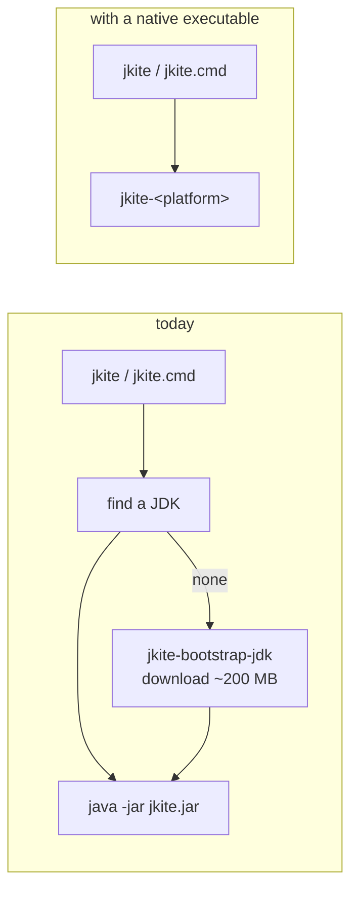

# Building a native executable

jkite is a jar, and a jar needs a JVM. That single fact is why the launchers
are as large as they are: before they can run jkite they have to find a Java,
and when the machine has none they install one. `jkite-bootstrap-jdk` and its
cmd twin exist for nothing else, and `jkite.properties` carries a JDK URL and
digest for each of six platforms to feed them.

A native executable removes the premise. GraalVM's `native-image` compiles the
jar ahead of time into a program the operating system runs directly, so there
is no JVM to find and nothing to install before jkite starts.

## What changes



The JDK does not disappear from jkite's life: a script still declares `//JAVA`
and still needs a compiler. But that JDK is installed by jkite itself, in Java,
where the logic already lives (`jdk/JdkManager`). What goes away is the second,
earlier JDK whose only job was to start jkite.

## What native-image needs to know

`native-image` decides at build time which code can ever run, and leaves out
the rest. That is where the size and the startup time come from, and also the
one way it can go wrong: code reached by name at run time - reflection, a
resource read off the class path, a service looked up by interface - is
invisible to that analysis unless it is declared.

Those declarations live in `src/native-image/config/reachability-metadata.json`.
jkite's is small, and it is small for reasons worth keeping:

| Library | Why it is cheap |
| --- | --- |
| gson | Used through the tree API (`JsonParser`, `JsonObject`), never bound to classes. Nothing to register. |
| commons-compress | Streams are constructed directly (`new TarArchiveInputStream`), not looked up through `ArchiveStreamFactory`. No service lookup. |
| MIMA / Maven Resolver | Runs on `standalone-static`, the runtime that wires itself without dynamic injection. Needs a handful of `.properties` resources, nothing more. |
| slf4j-nop, jspecify | No run-time lookup at all. |

What the metadata does contain is mostly not jkite's: the JDK's own cipher and
key classes, which TLS reaches by name, and the resources Maven Resolver reads
to learn its own version.

The file is regenerated by running the jar under the tracing agent, which
records what the code actually reaches:

```sh
"$GRAALVM_HOME/bin/java" \
  -agentlib:native-image-agent=config-output-dir=src/native-image/config \
  -jar build/libs/jkite.jar some-script-with-deps.java
```

Exercise the network path when doing this. A run that resolves everything from
the local repository never opens a TLS connection, and the cipher classes will
be missing from the result.

## Building

```sh
export GRAALVM_HOME=/path/to/graalvm-community-25   # or put native-image on PATH
./gradlew nativeImage
```

The output is `build/native-image/jkite-<platform>` - `linux-amd64`,
`darwin-arm64`, and so on, named the way `jkite.properties` names platforms so
a built file drops straight into that table. A `.sha256` file is written beside
it, because that is how a release pins anything here.

`--no-fallback` is passed on purpose. Without it, a build that cannot resolve
everything quietly emits a launcher that needs a JVM after all - an executable
that looks right and defeats the point. With it, that case is a failed build.

## One platform per machine

`native-image` does not cross-compile. An executable is built for the machine
building it, so shipping six platforms means building on six machines. That is
what `.github/workflows/native.yml` is: one runner per row of
`jkite.properties`, all of them GitHub-hosted.

arm64 Linux and Windows runners became generally available for public
repositories in August 2025, which is what makes four of the five rows possible
without self-hosted machines or QEMU.

The fifth platform, `darwin-amd64`, is not built. GraalVM removed macOS x64
after 25.0.1: releases from 25.0.2 on ship no `macos-x64` build, so there is no
compiler to run. Pinning an Intel Mac job to 25.0.1 would freeze it on a
release that no longer receives fixes, which is worse than shipping nothing, so
Intel Macs get the jar instead. GitHub is retiring `macos-15-intel` in August
2027 regardless.

This is the shape of the risk generally: a native target exists only while
someone builds a compiler for it. Losing one is not a build failure to debug,
it is a platform moving back to the jar.

## Which GraalVM

`native-image` comes from a GraalVM distribution, and there are several. They
are the same technology; what differs is who builds and supports it.

| | |
| --- | --- |
| **GraalVM Community Edition** | Open source, GPLv2+CE. What CI uses and what this was developed against. |
| Oracle GraalVM | Oracle's build, under the GraalVM Free Terms and Conditions. |
| Mandrel | Red Hat's rebuild of Community Edition, native-image only, maintained for Quarkus. |
| Liberica NIK | BellSoft's build. |

Worth knowing while choosing: in September 2025 Oracle detached GraalVM from
the Java SE release train. GraalVM for JDK 24 was the last release covered by
Oracle Java SE support, the Graal JIT left the Oracle JDK, and Oracle's team
moved its focus to the non-Java Graal languages, with Java startup and
footprint work continuing in OpenJDK's Project Leyden instead. OpenJDK's
Project Galahad, which was to bring this technology into the JDK, was dissolved
in March 2026.

Native Image itself was not deprecated: Community Edition releases monthly, and
Red Hat continues Mandrel for Quarkus. But the technology is now carried by the
community rather than by Oracle's Java strategy, which is a reason to keep the
jar working rather than to treat the executable as the only way jkite runs.

## Measured

On one Linux x64 machine, GraalVM CE 25.0.1:

| | jar on a JVM | native |
| --- | --- | --- |
| startup (`--version`, median of 7) | 49 ms | 4 ms |
| size | 6.3 MB jar + a JDK | 40 MB, nothing else |
| build | seconds | 1 m 21 s |

Verified end to end: `--version`, `--help`, running a plain script, resolving a
dependency from the local repository, and downloading one from Maven Central
over HTTPS.

## Things that behave differently

**`java.home` is not set.** There is no JVM under the executable, so
`System.getProperty("java.home")` returns null. `JdkManager.listInstalled`
treats that as "this process contributes no JDK" rather than dereferencing it;
the other origins - `JAVA_HOME`, `javac` on `PATH`, the cache - are unaffected.

**`JAVA_TOOL_OPTIONS` and `_JAVA_OPTIONS` are ignored.** They are JVM
mechanisms, and there is no JVM. Anywhere that uses them to inject a proxy, a
truststore or heap settings - a corporate network with TLS interception is the
common case - those settings stop reaching jkite, silently, and TLS fails with
a certificate error rather than with an explanation.

**The jar is still needed.** Not every machine is one of the six, and the jar
remains the answer for the rest. A native executable is the default path, not
the only one.
